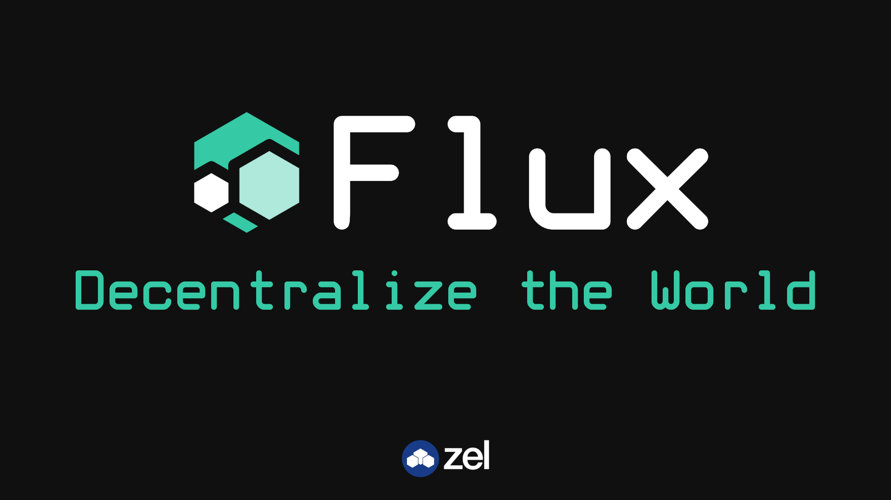

# Flux - Node Daemon



[](https://deepscan.io/dashboard#view=project&tid=6436&pid=8442&bid=100920) [](https://www.codefactor.io/repository/github/zelcash/zelflux)[](https://lgtm.com/projects/g/zelcash/zelflux/context:javascript)

Flux is available on domains, load balancing the entire Flux network. You can access both UI and API on following main domain

[Flux](https://home.runonflux.io)

[API](https://api.runonflux.io)

## API Documentation

[API documentation](https://zelcash.github.io/zelfluxdocs/)

## The gateway to the Zel Network

Flux is the frontend UI to the entire Zel Network, it enables ZelNode operators to manage their ZelNode easily via a simple web interface. Flux enables a ZelNode operator to perform all tasks such as updating and maintenance from a simple web interface, instead of having to remotely login to their ZelNode to manage it.

Flux Requires a reasonably new version of Node.js (npm), MongoDB and Docker. It is a MongoDB, Express.js, Vue.js, Node.js (MEVN) application

This application communicates locally with the ZelCash Daemon (zelcashd), ZelBench Daemon (benchmarkd) and with other ZelNode Daemons (Flux).

## Application Overview

### Backend Solution - zelback

- Provide communication with zelcashd
- Providing private API, and public API, ZelNode team API (limited!)
- Listen and handle frontend requests
- Requests signing and authenticity verifying
- Handle communication with other zelnode daemons (Flux solution)
- Manage ZelNode applications - smart spawning, distributing workload, termination depending of application subscription.
- and more!

### Frontend Solution - zelfront

- Display ZelNode status information
- Display Zel Network information
- Display ZelCash status information
- Display ZelCash network information
- Display Specific application information
- Provide API access
- Login into private API part (frontend part)
- Login into ZelNode team API part (frontend part)
- Private: Management of ZelNode
- Private: Management of ZelCash
- Private: Update, status information
- and more!

This application is open source and distributed under the GNU AGPLv3 licence

## Start Flux

Flux needs Zelcashd to be ruuning, to setup Zelcashd follow [these instructions.](https://github.com/zelcash/ZelNodeInstallv3)

build-essential is a recommended dependency

```bash

sudo apt-get build-essential
```

Setup Mongodb on Ubuntu 16.04 (LTS):

```bash
wget -qO - https://www.mongodb.org/static/pgp/server-4.2.asc | sudo apt-key add -

echo "deb [ arch=amd64 ] https://repo.mongodb.org/apt/ubuntu xenial/mongodb-org/4.2 multiverse" | sudo tee /etc/apt/sources.list.d/mongodb-org-4.2.list

sudo apt-get update

sudo apt-get install -y mongodb-org

sudo service mongod start
```

Setup Mongodb on Ubuntu 18.04 (LTS):

```bash
wget -qO - https://www.mongodb.org/static/pgp/server-4.2.asc | sudo apt-key add -

echo "deb [ arch=amd64 ] https://repo.mongodb.org/apt/ubuntu bionic/mongodb-org/4.2 multiverse" | sudo tee /etc/apt/sources.list.d/mongodb-org-4.2.list

sudo apt-get update

sudo apt-get install -y mongodb-org

sudo service mongod start
```

Setup Mongodb on Red Hat or CentOS:

```bash
sudo yum install nano

sudo nano /etc/yum.repos.d/mongodb-org-4.2.repo

# Paste below into the mongodb-org-4.2.repo file

[mongodb-org-4.2]
name=MongoDB Repository
baseurl=https://repo.mongodb.org/yum/redhat/$releasever/mongodb-org/4.2/x86_64/
gpgcheck=1
enabled=1
gpgkey=https://www.mongodb.org/static/pgp/server-4.2.asc

# exit nano

sudo yum install -y mongodb-org

# Start Mongodb on startup for CentOS 7
sudo systemctl enable mongod.service

# Start Mongodb on startup for CentOS 5/6
sudo chkconfig mongod on

# Start Mongodb on CentOS 7
sudo systemctl start mongod.service

# Start Mongodb on CentOS 5/6
sudo service mongod start
```

Install Node Version Manager (NVM) and NodeJS 12 on Ubuntu 16.04/18.04:

```bash
sudo apt-get install curl

curl -o- https://raw.githubusercontent.com/nvm-sh/nvm/v0.35.0/install.sh | bash

source ~/.profile

nvm install 12

nvm use 12
```

Install Node Version Manager (NVM) and NodeJS 12 on Redhat/CentOS:

```bash
sudo yum install curl

curl -o- https://raw.githubusercontent.com/nvm-sh/nvm/v0.35.0/install.sh | bash

source ~/.bashrc

nvm install 12

nvm use 12
```

Install Docker using snap

```bash
snap install docker
```

Clone Flux repo (Ubuntu):

```bash
sudo apt-get install git

git clone https://github.com/zelcash/Flux
```

Clone Flux repo (Redhat/CentOS):

```bash
sudo yum install git

git clone https://github.com/zelcash/Flux
```

Allow Inbound Connections on UFW firewall (ONLY if ufw enabled):

```bash
sudo ufw allow 16126/tcp
sudo ufw allow 16127/tcp
```

Install Flux dependancies (Ubuntu/CentOS/Redhat):

```bash
cd Flux

npm install
```

To run this as Production:

```bash
npm start
```

To run this as Development: Start both solutions with

```bash
npm run zelbackdev
npm run zelfrontdev
```

THE SETUP ENDS HERE...
The following information below provided for brief usage guidelines and/or examples only.

## Flux Home Information

> Frontend interface to interact with the Zel network
> Uses port 16126

## Build Setup

```bash
# serve with hot reload at localhost:16126
npm run zelfrontdev

# build for production with minification
npm run zelfrontbuild

# build for production and view the bundle analyzer report
npm run zelfrontbuild --report
```

## Flux Information

> Backend interface to interact with the Zel Network
> Uses port 16127

## Continued Build Setup

```bash
# serve with hot reload at localhost:16126
npm run zelbackdev
```

Made with ❤️ by the Flux Team
